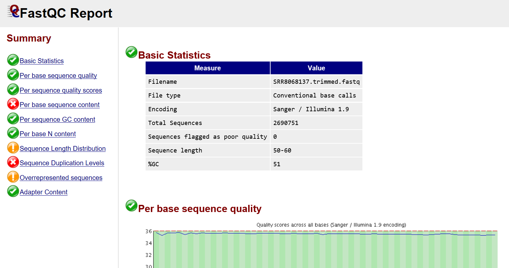
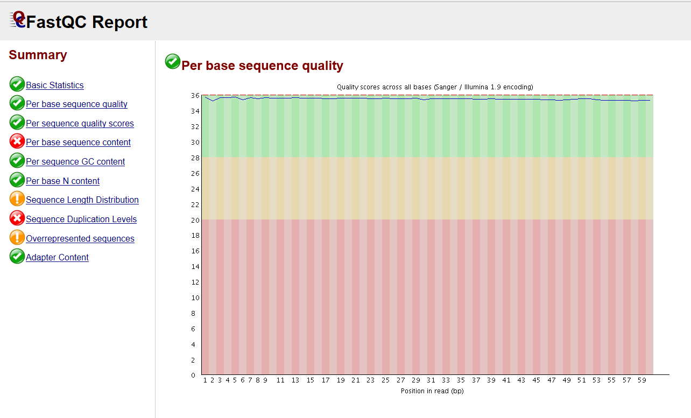
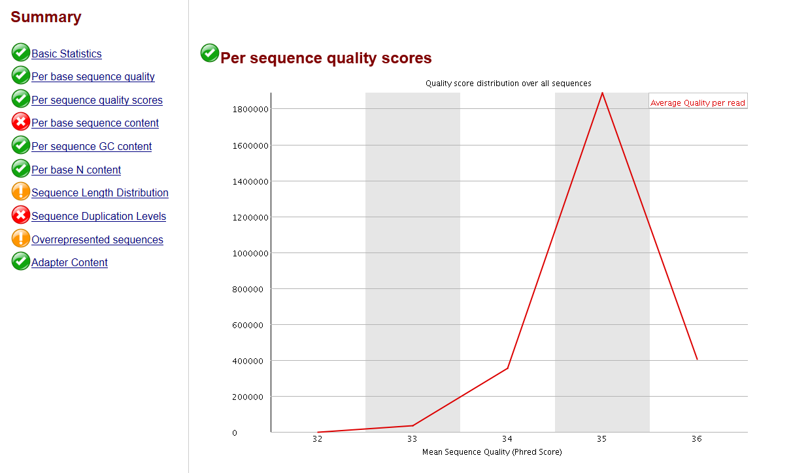
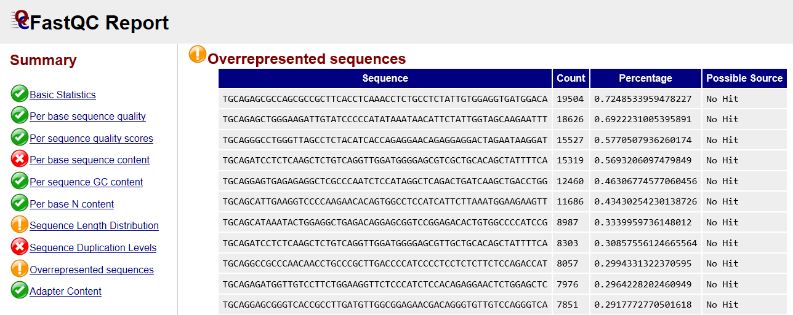
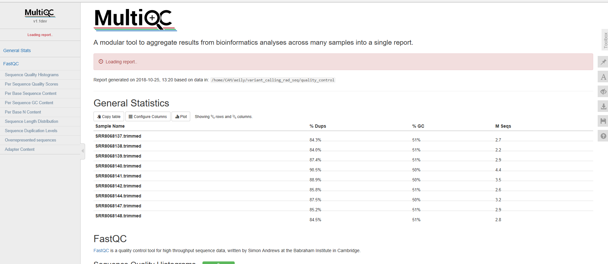

# Variant calling with FreeBayes
This is a tutorial on how to perform variant calling with FreeBayes.

This repository is a usable, publicly available non-model variant calling tutorial. By the end of this tutorial you should be well-versed in using bioinformatics tools and taking computational approaches to difficult biological problems.
All steps have been provided for the UConn CBC Xanadu cluster here with appropriate headers for the Slurm scheduler that can be modified simply to run.  Commands should never be executed on the submit nodes of any HPC machine.  If working on the Xanadu cluster, you should use sbatch scriptname after modifying the script for each stage.  Basic editing of all scripts can be performed on the server with tools, such as nano, vim, or emacs.  If you are new to Linux, ple# DNA-Seq: Non-model species variant calling
This repository is a usable, publicly available non-model variant calling tutorial. By the end of this tutorial you should be well-versed in using bioinformatics tools and taking computational approaches to difficult biological problems.
All steps have been provided for the UConn CBC Xanadu cluster here with appropriate headers for the Slurm scheduler that can be modified simply to run.  Commands should never be executed on the submit nodes of any HPC machine.  If working on the Xanadu cluster, you should use sbatch scriptname after modifying the script for each stage.  Basic editing of all scripts can be performed on the server with tools, such as nano, vim, or emacs.  If you are new to Linux, please use <a href="https://bioinformatics.uconn.edu/unix-basics/">this</a> handy guide for the operating system commands.  In this guide, you will be working with common bioinformatic file formats, such as <a href="https://en.wikipedia.org/wiki/FASTA_format">FASTA</a>, <a href="https://en.wikipedia.org/wiki/FASTQ_format">FASTQ</a>, <a href="https://en.wikipedia.org/wiki/SAM_(file_format)">SAM/BAM</a>, and <a href="https://en.wikipedia.org/wiki/General_feature_format">GFF3/GTF</a>. You can learn even more about each file format <a href="https://bioinformatics.uconn.edu/resources-and-events/tutorials/file-formats-tutorial/">here</a>. If you do not have a Xanadu account and are an affiliate of UConn/UCHC, please apply for one <a href="https://bioinformatics.uconn.edu/contact-us/">here</a>.

Contents

<ul class="toc_list">
<li><a href="#First_Point_Header">1 Overview</>
<li><a href="#Second_Point_Header">2 Accessing the data using sra-toolkit</a></li>
<li><a href="#Third_Point_Header">3 Quality control using sickle, MultiQC, and fastqc</a></li>
<li><a href="#Fourth_Point_Header">4 De novo genome assembly using SPAdes (step omitted with model organism)</a></li>
<li><a href="#Fifth_Point_Header">5 Aligning reads to de novo assembly with HISAT2 </a></li>
<li><a href="#Sixth_Point_Header">6 Variant calling with FreeBayes</a></li>
  <li><a href="#Seventh_Point_Header">7 Analyzing output in R</a></li>
	<li><a href="Eighth_Point_Header">8 Finishing touches in R</a></li>
</ul>

<h2 id="First_Point_Header">Overview</h2>

In this tutorial we will be analyzing <a href="https://en.wikipedia.org/wiki/Restriction_site_associated_DNA_markers">double-digested restriction site associated DNA (ddrad-seq)</a> samples from the freshwater whitefish, <a href="https://en.wikipedia.org/wiki/Coregonus_lavaretus"><i>Coregonus lavaretus</i></a> drawn from <a href="https://en.wikipedia.org/wiki/Lake_Constance">Lake Constance</a>. The SRA pages for the samples may be found <a href="https://www.ncbi.nlm.nih.gov/sra/?term=lake+constance+weissfelchen">here</a>. Our objective is to identify SNPs and halpotypes for the 9 samples. Let's begin.

<h2 id="Second_Point_Header">Accessing the data using sra-toolkit </h2>

We will be downloading our data from the sequence-read-archives (SRA), a comprehensive collection of sequenced genetic data submitted to the NCBI by experimenters. The beauty of the SRA is the ease with which genetic data becomes accessible to any scientist with an internet connection, available for download in a variety of formats. Each run in the SRA has a unique identifier. The run may be downloaded using a module of software called the "sratoolkit" and its unique identifier. There are a variety of commands in the sratoolkit, which I invite you to investigate for yourself at https://www.ncbi.nlm.nih.gov/books/NBK158900/.

The data may be accessed at the following web page: https://www.ncbi.nlm.nih.gov/sra/?term=lake+constance+weissfelchen

We will be using the `fastq-dump` command of the sratoolkit. So for our first file with sample ID SRR8068137 we run:

<pre style="color: silver; background: black;">-bash-4.2$ fastq-dump SRR8068137</pre>

However, if you have read the tutorial on using `Xanadu` then you are well aware that we cannot type this into the terminal and execute it there. Instead, we must place our commands in a script and submit the script to the compute nodes. If you have any questions on this, please visit the `Xanadu` tutorial, and more specifically the 'How to Submit a Script' portion beneath <a href="https://bioinformatics.uconn.edu/resources-and-events/tutorials-2/xanadu/#Xanadu_6">here</a>. Let's write our script:

`-bash-4.2$ nano fastq_dump.sh`

<pre style="color: silver; background: black;"> GNU nano 2.3.1                                                      File: fastq_dump.sh                                                                                                                   

#!/bin/bash
#SBATCH --job-name=fastq_dump
#SBATCH -N 1
#SBATCH -n 1
#SBATCH -c 1
#SBATCH --partition=general
#SBATCH --mail-type=ALL
#SBATCH --mail-user=your_email@your_email.com
#SBATCH --mem=10G
#SBATCH --partition=general
#SBATCH --qos=general
#SBATCH -o %x_%j.out
#SBATCH -e %x_%j.err
module load sratoolkit

fastq-dump SRR8068137
fastq-dump SRR8068138
fastq-dump SRR8068139
fastq-dump SRR8068140
fastq-dump SRR8068141
fastq-dump SRR8068142
fastq-dump SRR8068144
fastq-dump SRR8068147
fastq-dump SRR8068148

^G Get Help                       ^O WriteOut                       ^R Read File                      ^Y Prev Page                      ^K Cut Text                       ^C Cur Pos
^X Exit                           ^J Justify                        ^W Where Is                       ^V Next Page                      ^U UnCut Text                     ^T To Spell</pre>

You may be tempted to request multiple cores for all of your submissions with the thought that more cores and memory means increased performance. However, data-downloads and a few softwares do not support multi-threading and can only use one core. For data-downloads I suggest one core with 10G of memory. After we receive the email that our job has completed we use the command `ls` to view the contents of the directory.

<pre style="color: silver; background: black;">-bash-4.2$ ls
SRR8068137.fastq	SRR8068138.fastq	SRR8068147.fastq
SRR8068139.fastq	SRR8068140.fastq	SRR8068148.fastq
SRR8068141.fastq	SRR8068142.fastq	SRR8068144.fastq
</pre>

Let's move these fastqs into their own directory:
<pre style="color: silver; background: black;">-bash-4.2$ mkdir sample_files
-bash-4.2$ mv &#42;fastq sample_files</pre>

Let's take a look at one of the fastq files:

<pre style="color: silver; background: black;">-bash-4.2$ cd sample_files
-bash-4.2$ head SRR8068137.fastq
TGCAGTGGTCAGCTGAGGCGGACAGGGCTTTTGGTCACCTGAAGGCTCTGTTCACCTCGG
+SRR8068137.1 1_11101_12207_1061 length=60
#/EEEEEEEEEEEEEEEEEEE6EEEEEEEEEEEEEEEEEEEEEEAEEEEEEEAEEEEEEE
@SRR8068137.2 1_11101_9446_1065 length=60
TGCAGAGCTGGGAAGATTGTATCCCCCATATAAATAACATTCTATTGGTAGCAATAATTT
+SRR8068137.2 1_11101_9446_1065 length=60
#EEEEEEEEEEEEEEEEEEEEEEEEEEEEEEEEEEEEEEEEEEEEEEEEEEEEEEEEEEE
@SRR8068137.3 1_11101_16985_1065 length=60
TGCAGAGATGGTTGTCCTTCTGGAAGGTTCTCCCATCTCCACAGAGGAACTCTGGAGCTC
</pre>

We see that for our first three runs we have information about the sampled read including its length followed by the nucleotide read and then a "+" sign. The "+" sign marks the beginning of the corresponding scores for each nucleotide read for the nucleotide sequence preceding the "+" sign. 

<h2 id="Third_Point_Header">Quality control using sickle, MultiQC, and fastqc </h2>

A theme which will come up later in this tutorial but is of importance at the quality control stage is that base-calling is statistical in nature. To generate the reads the digested DNA fragements are simultaneously amplified using <a href="https://www.genome.gov/10000207/polymerase-chain-reaction-pcr-fact-sheet/">polymerase chain reaction</a> and "read" by a sequencing machine via <a href="https://en.wikipedia.org/wiki/Pyrosequencing">light emission</a>. However, because of the absence of proof-reading enzymes in vitro, occasionally during amplification an incorrect base-pair is incorporated into the strand. As that strand goes through more rounds of amplification, the erroneous base-pair is read by the sequencer. In this section of the sequences, there will be two distinct pulses of light emitted rather than one color (if there were no errors). Depending on the intensities of the differing light pulses the sequencer assigns as score to the likelihood that the base-pair detected is the correct one. 

Knowing all of this, it is prudent to remove sequences or regions with low quality-scores so as to increase our confidence in the analysis. One way of doing this is through the software <a href="https://github.com/najoshi/sickle/blob/master/README.md">sickle</a>, which analyzes small contiguous portions of the read, calculating an average quality score for the portion. Should the regional quality score dip beneath a value of our choosing sickle will determine the base-pairs responsible for the dip and excise them. There is a second threshold that we set for the length of the final, trimmed read. Should enough base-pairs be excised from a single read such that the final length of the read is beneath the threshold sickle will remove the read entirely. Let's have a look at the options of sickle:

<pre style="color: silver; background: black;">-bash-4.2$ module load sickle
-bash-4.2$ sickle --help 

Usage: sickle <command> [options]

Command:
pe	paired-end sequence trimming
se	single-end sequence trimming

--help, display this help and exit
--version, output version information and exit
</pre>

We have single-end reads. Let's investigate:

<pre style="color: silver; background: black;">-bash-4.2$ sickle se --help
<strong>Usage</strong>: sickle se [options] -f <fastq sequence file> -t <quality type> -o <trimmed fastq file>

<strong>Options</strong>:
-f, --fastq-file, Input fastq file (required)
-t, --qual-type, Type of quality values (solexa (CASAVA < 1.3), illumina (CASAVA 1.3 to 1.7), sanger (which is CASAVA >= 1.8)) (required)
-o, --output-file, Output trimmed fastq file (required)
-q, --qual-threshold, Threshold for trimming based on average quality in a window. Default 20.
-l, --length-threshold, Threshold to keep a read based on length after trimming. Default 20.
-x, --no-fiveprime, Don't do five prime trimming.
-n, --trunc-n, Truncate sequences at position of first N.
-g, --gzip-output, Output gzipped files.
--quiet, Don't print out any trimming  Information
--help, display this help and exit
--version, output version  Information and exit</pre>

Almost all sequencing scores are _sanger_ scores. However, if your scores are not then an error will be returned. The <a href="https://en.wikipedia.org/wiki/FASTQ_format#Quality">quality score</a> may range anywhere from 1 to 40. A good threshold to set for this is typically 30, which is about >90% confidence in the base-pair call. Our reads are anywhere between 60-75bp, a good threshold to set for the length is no reads with fewer than 50bp. The final options we may entrust to the default. Before we continue, let's set up our directory a little better by giving everything its own place:

<pre style="color: silver; background: black;">-bash-4.2$ cd ../
-bash-4.2$ mkdir stderr_stdout
-bash-4.2$ mv &#42;err stderr_stdout
-bash-4.2$ mv &#42;out stderr_stdout
-bash-4.2$ mkdir scripts
-bash-4.2$ mv &#42;sh scripts</pre>

Now let's give our sickle'd sequences their own spot before continuing:

<pre style="color: silver; background: black;">-bash-4.2$ mkdir trimmed_sample_files</pre>

For the rest of this tutorial we will be using Linux loops. Particularly, the <a href="https://www.cyberciti.biz/faq/bash-for-loop/">for loops</a>. It is advised you read the linked reading before continuing. We can now write our sickle script:

<pre style="color: silver; background: black;">-bash-4.2$ cd scripts
-bash-4.2$ nano sickle.sh

  GNU nano 2.3.1                                                       File: sickle.sh                                                                                                                      

#!/bin/bash
#SBATCH --job-name=sickle
#SBATCH -N 1
#SBATCH -n 1
#SBATCH -c 1
#SBATCH --partition=general
#SBATCH --mail-type=ALL
#SBATCH --mail-user=your_email
#SBATCH --mem=10G
#SBATCH --partition=general
#SBATCH --qos=general
#SBATCH -o %x_%j.out
#SBATCH -e %x_%j.err
module load sickle

for file in ../sample_files/&#42;; do export BASENAME=$(basename $file .fastq).trimmed.fastq; sickle se -f $file -t sanger -o ../trimmed_sample_files/$BASENAME -q 30 -l 50; done;

^G Get Help                       ^O WriteOut                       ^R Read File                      ^Y Prev Page                      ^K Cut Text                       ^C Cur Pos
^X Exit                           ^J Justify                        ^W Where Is                       ^V Next Page                      ^U UnCut Text                     ^T To Spell
</pre>

`-bash-4.2$ sbatch sickle.sh`

Let's take a quick moment to review one piece of this code:
<pre style="color: silver; background: black;">-bash-4.2$ export BASENAME=$(basename $file .fastq).trimmed.fastq</pre>

Take the file `/home/CAM/$USER/variant_calling_rad_seq/sample_files/SRR8068137.fastq` :

<pre style="color: silver; background: black;">-bash-4.2$ export BASENAME=$(basename /home/CAM/$USER/variant_calling_rad_seq/sample_files/SRR8068137.fastq); echo $BASENAME

<strong>SRR8068137.fastq</strong></pre>

So the function `$(basename $file)` removes the parent directories from the filename. Now:

<pre style="color: silver; background: black;">-bash-4.2$ export BASENAME=$(basename /home/CAM/$USER/variant_calling_rad_seq/sample_files/SRR8068137.fastq .fastq).trimmed.fastq; echo $BASENAME

<strong>SRR8068137.trimmed.fastq</strong></pre>

We see the added portion removes the extension of the filename and replaces it with an extension of our choosing. In doing this, we can rename all of our files in our loop without having to know the actual filenames. Removing the parent directories from the filename also enables us to save the files in `../trimmed_sample_files/`. Notice that if we had not removed the parent directories the file would attempt to save in `../trimmed_sample_files/home/CAM/$USER/variant_calling_rad_seq/sample_files/` which obviously is not a real directory!

Now let's move our standard error and output files, look at the new directory, and check the standard error and output files:
<pre style="color: silver; background: black;">-bash-4.2$ mv &#42;err ../stderr_stdout
-bash-4.2$ mv &#42;out ../stderr_stdout
-bash-4.2$ cd ../
-bash-4.2$ ls trimmed_sample_files
<strong>SRR8068137.trimmed.fastq  SRR8068139.trimmed.fastq  SRR8068141.trimmed.fastq  SRR8068144.trimmed.fastq  SRR8068148.trimmed.fastq
SRR8068138.trimmed.fastq  SRR8068140.trimmed.fastq  SRR8068142.trimmed.fastq  SRR8068147.trimmed.fastq
</strong>
-bash-4.2$ cd stderr_stdout
-bash-4.2$ head sickle&#42;out
<strong>
SE input file: ../sample_files/SRR8068137.fastq

Total FastQ records: 4010244
FastQ records kept: 2690751
FastQ records discarded: 1319493

SE input file: ../sample_files/SRR8068138.fastq</strong></pre>

We see we have discarded quite a large number of reads. In my opinion, it is better to work on a smaller, more robust dataset than a large and inaccurate dataset.

We can get a snapshot of the quality of the data using <a href="https://www.bioinformatics.babraham.ac.uk/projects/fastqc/">fastqc</a> and <a href="https://github.com/ewels/MultiQC/blob/master/README.md">multiqc</a>. While fastqc and multiqc do not have `--help` options, it is quite easy to use. I am going to go ahead and present the script here with limited explanation because not much is needed:

<pre style="color: silver; background: black;">-bash-4.2$ cd ../
-bash-4.2$ mkdir quality_control
-bash-4.2$ cd scripts
-bash-4.2$ nano quality_control.sh

  GNU nano 2.3.1                                                    File: quality_control.sh                                                                                                                

#!/bin/bash
#SBATCH --job-name=quality_control
#SBATCH -N 1
#SBATCH -n 1
#SBATCH -c 1
#SBATCH --partition=general
#SBATCH --mail-type=ALL
#SBATCH --mail-user=your_email
#SBATCH --mem=10G
#SBATCH --partition=general
#SBATCH --qos=general
#SBATCH -o %x_%j.out
#SBATCH -e %x_%j.err

module load fastqc
module load MultiQC

mkdir /home/CAM/$USER/tmp/
export TMPDIR=/home/CAM/$USER/tmp/

for file in ../trimmed_sample_files/&#42;; do fastqc $file -o ../quality_control; done;

cd ../quality_control
multiqc .
                                                                                             [ Read 24 lines ]
^G Get Help                       ^O WriteOut                       ^R Read File                      ^Y Prev Page                      ^K Cut Text                       ^C Cur Pos
^X Exit                           ^J Justify                        ^W Where Is                       ^V Next Page                      ^U UnCut Text                     ^T To Spell
</pre>

<pre style="color: silver; background: black;">-bash-4.2$ sbatch quality_control.sh</pre>

fastqc will create the files "trimmed_file_fastqc.html". To have a look at one, we need to move all of our `quality_control` folder to our local machine using <a href="https://www.techrepublic.com/article/how-to-use-secure-copy-for-file-transfer/">secure copy</a>. Then, we may open our files. To do this we do:

<pre style="color: silver; background: black;">scp -r <your_user_name>@transfer.cam.uchc.edu:/home/CAM/<your_user_name>/variant_calling_rad_seq/quality_control .</pre>

The `-r` option is used to transfer folders, and `.` will transfer the folder to your home directory on your local machine.

Let's have a look at the file format from fastqc and multiqc. When loading the fastqc file, you will be greeted with this screen:

There are some basic statistics which are all pretty self-explanatory. Notice that none of our sequences fail the quality report! It would be concerning if we had even one because this report is from our trimmed sequence! The same thinking applies to our sequence length. Should the minimum of the sequence length be below 45, we would know that sickle had not run properly. Let's look at the next index in the file:

This screen is simply a line graph of our quality scores per base pair. Note that there is a large variance and lower mean scores (but still about in our desired range) for base pairs 1-5. These are the primer sequences! I will leave it to you to ponder the behavior of this graph. If you're stumped, you may want to learn how <a href="https://www.illumina.com/techniques/sequencing.html">Illumina sequencing"</a> works.

Our next index is the per sequence quality scores:

This index is simply the total number of base pairs (y-axis) which have a given quality score (x-axis). This plot is discontinuous and discrete, and should you calculate the <a href="https://en.wikipedia.org/wiki/Riemann_sum">Riemann sum</a> the result is the total number of base pairs present across all reads.
	
The last index at which we are going to look is the "Overrepresented Sequences" index:

This is simply a list of sequences which appear disproportionately in our reads file. The reads file actually includes the primer sequences for this exact reason. When fastqc calculates a sequence which appears many times beyond the expected distribution, it may check the primer sequences in the reads file to determine if the sequence is a primer. If the sequence is not a primer, the result will be returned as "No Hit". Sequences which are returned as "No Hit" are most likely highly expressed genes.

We see that our multiqc file has the same indices as our fastqc files, but is simply the mean of all the statistics across our fastqc files:

<h2 id="Fourth_Point_Header">De novo genome assembly using SPAdes</h2>
<strong>This step is omitted for organisms for which there is a reference fasta available.</strong>

Because there is no reference genome for our organism we have to take our sequences and assemble them into a reference on our own. The theory behind this is simple but belies the complereference fasta available. For this tutorial, is omitted for organisms for which there is a reference fasta available. For this tutorial, xity of the task: If we see the tail-end of one sequence significantly overlapping with the leading end of a separate sequence we can combine the two sequences to form one longer sequence. We continue doing this until the sequences cannot be extended any longer. To do this we will be using the St. Petersburg genome Assembler, otherwise known as <a href="http://spades.bioinf.spbau.ru/release3.11.1/manual.html">SPAdes</a>. Because our sequences are DNA, we may mostly stick to the default options. As a matter of fact, aside from having to list our files, the only options we must include are `-o` for output directory, `-m` for memory limit (in GB), and `-t` for the number of cores. Our files are single-end, and if you can find it in the manual must be listed with `--s1 (file 1) --s2 (file 2) --s3 (file 3) . . .` and so on. All together, our script will look like:

<pre style="color: silver; background: black;">-bash-4.2$ cd scripts
-bash-4.2$ nano general_assembly.sh

  GNU nano 2.3.1                                                    File: general_assembly.sh                                                                                                     Modified  

#!/bin/bash
#SBATCH --job-name=assembly
#SBATCH -N 1
#SBATCH -n 1
#SBATCH -c 4
#SBATCH --partition=general
#SBATCH --mail-type=ALL
#SBATCH --mail-user=your_email
#SBATCH --mem=10G
#SBATCH --partition=general
#SBATCH --qos=general
#SBATCH -o %x_%j.out
#SBATCH -e %x_%j.err

mkdir ../assembly

module load SPAdes

cd ../trimmed_sample_files/
 
spades.py --s1 SRR8068137.trimmed.fastq --s2 SRR8068139.trimmed.fastq --s3 SRR8068141.trimmed.fastq --s4 SRR8068144.trimmed.fastq --s5 SRR8068148.trimmed.fastq --s6 SRR8068138.trimmed.fastq --s7 SRR8068140.trimmed.fastq --s8 SRR8068142.trimmed.fastq --s9 SRR8068147.trimmed.fastq -o ../assembly -m 10 -t 4

^G Get Help                       ^O WriteOut                       ^R Read File                      ^Y Prev Page                      ^K Cut Text                       ^C Cur Pos
^X Exit                           ^J Justify                        ^W Where Is                       ^V Next Page                      ^U UnCut Text                     ^T To Spell
</pre>

<pre style="color: silver; background: black;">-bash-4.2$ sbatch general_assembly.sh
-bash-4.2$ cd ../assembly
-bash-4.2$ ls

<strong>assembly_graph.fastg  contigs.fasta  corrected     input_dataset.yaml  K33  misc        scaffolds.fasta  spades.log  warnings.log
before_rr.fasta       contigs.paths  dataset.info  K21                 K55  params.txt  scaffolds.paths  tmp</strong></pre>

We see there are a few directories: `K21`, `K33`, `K55`. These represent the initial size of each segment attempted to be extended. The assembler will take the results from these sizes and attempt to stitch those together. From the manual we find out that the only file of concern for us is `scaffolds.fasta`, which contains our assembled genome. Let's have a look at it:

<pre style="color: silver; background: black;">-bash-4.2$ head scaffolds.fasta

>NODE_1_length_445_cov_0.0666667
TGCAGGACCTTAATGTGCTTCTTCTTGAGCCACTCCTTTGTTGCCTTGGCCGTGTGTTTT
GGGTCATTGTCATGCTGGAATACCCATCCACGACCCATTTTCAATGCCCTGGCTGAGGGA
AGGAGGTTCTCACCCAAGATTTGACGGTACATGGCCCCGTCCATCGTCCCTTTGATGCGG
TGAAGTTGTCCTGTCCCCTTAGCAGAAAAACACCCCCAAAGCATAATGTTTCCACCTCCA
TGTTTGACGGTGGGGATGGTGTTCTTGGGGTCATAGGCAGCATTCCTCCTCCTCCAAACA
CAGCGAGTTGAGTTGATGCCAAAGAGCTCGATTTTGGTCTCATCTGACCACAACACTTTC
ACCCAGTTCTCCTCTGAATCATTCAGATGTTCATTGGCAAACTTCAGACGGGCCTGTATA
TGTGCTTTCTTGAGCAGGGGGACCT
>NODE_2_length_398_cov_0.387755
</pre>

<h2 id="Fifth_Point_Header">Aligning reads to de novo assembly with HISAT2</h2>

Now that we have our assembled genome, we can map our sequences to it. For this, we will be using <a href=https://github.com/infphilo/hisat2/blob/master/README.md">HISAT2</a>. While it is not too terribly important to understand the mathematics behind the alignment process, it is important to understand why we map our reads to the reference. Mapping the reads to the reference is effectively labeling each read. The read names generated by the sequencer are arbitrary and not consistent across samples. By aligning those reads to one standard reference each read from each sample which is mapped to the same sequence will now have the same read name, allowing us to numerically compare across samples. Furthermore, in the mapping step, the sequence of the read is stored in the output, but not the reference. For us, as we are interested in determining variants, this will be useful because we can simply compare the sequences which have the same read names to see if they differ at all. Now, before we align our reads to our "reference", it is necessary for us to build a reference index. This is exactly as it sounds, building an index orders and compresses the reference such that there is as little work as necessary in matching a read to its reference (much like how a table of contents works, or, you know, an index). To do this we use the command `hisat2-build`. Let's have a look at this:

<pre style="color: silver; background: black;">-bash-4.2$ module load hisat2
-bash-4.2$ hisat2-build
No input sequence or sequence file specified!
HISAT2 version 2.1.0 by Daehwan Kim (infphilo@gmail.com, http://www.ccb.jhu.edu/people/infphilo)
Usage: hisat2-build [options]* <reference_in> <ht2_index_base>
    reference_in            comma-separated list of files with ref sequences
    hisat2_index_base       write ht2 data to files with this dir/basename
</pre>

We see we really only require to list our reference and the output we'd like for the index. The only option we will use is `-p` for the number of threads. Let's give the index it's own directory and write our script:

<pre style="color: silver; background: black;">-bash-4.2$ cd /home/CAM/$USER/variant_calling_rad_seq/
-bash-4.2$ mkdir index
-bash-4.2$ cd scripts
-bash-4.2$ nano hisat2_build_index.sh
  GNU nano 2.3.1                                                   File: hisat2_build_index.sh                                                                                                              

#!/bin/bash
#SBATCH --job-name=hisat2_build_index
#SBATCH -N 1
#SBATCH -n 1
#SBATCH -c 2
#SBATCH --partition=general
#SBATCH --mail-type=ALL
#SBATCH --mail-user=wolf.adam.eily@gmail.com
#SBATCH --mem=10G
#SBATCH --partition=general
#SBATCH --qos=general
#SBATCH -o %x_%j.out
#SBATCH -e %x_%j.err

module load hisat2

hisat2-build -p 2 ../assembly/scaffolds.fasta ../index/whitefish
                                                                                             [ Read 17 lines ]
^G Get Help                       ^O WriteOut                       ^R Read File                      ^Y Prev Page                      ^K Cut Text                       ^C Cur Pos
^X Exit                           ^J Justify                        ^W Where Is                       ^V Next Page                      ^U UnCut Text                     ^T To Spell
</pre>

<pre style="color: silver; background: black;">-bash-4.2$ sbatch hisat2_build_index.sh
-bash-4.2$ cd ../index
-bash-4.2$ ls

<strong>whitefish.1.ht2  whitefish.2.ht2  whitefish.3.ht2  whitefish.4.ht2  whitefish.5.ht2  whitefish.6.ht2  whitefish.7.ht2  whitefish.8.ht2</strong>

-bash-4.2$ head whitefish.1.ht2
<strong>.//
������������������<<<<<<<<:98%�Kx�����</strong>
</pre>

Because the index is compressed we cannot read it!

Now that we have our index we can write our alignment script. But first, let's give our alignment files their own directory:

<pre style="color: silver; background: black;">-bash-4.2$ mkdir ../alignments
-bash-4.2$ cd ../scripts
-bash-4.2$ module load hisat2
-bash-4.2$ hisat2 --help

<strong>Usage</strong>: hisat2 [options]* -x   [-S ]
-x         path to the Index-filename-prefix (minus trailing .X.ht2) 

Options:
-q                  query input files are FASTQ .fq/.fastq (default)
-p                  number threads
--dta               reports alignments tailored for transcript assemblers</pre>

<pre style="color: silver; background: black;">-bash-4.2 nano hisat2.sh

  GNU nano 2.3.1                                                      File: hisat2.sh                                                                                                                    
#!/bin/bash
#SBATCH --job-name=hisat2
#SBATCH -N 1
#SBATCH -n 1
#SBATCH -c 2
#SBATCH --partition=general
#SBATCH --mail-type=ALL
#SBATCH --mail-user=wolf.adam.eily@gmail.com
#SBATCH --mem=5G
#SBATCH --partition=general
#SBATCH --qos=general
#SBATCH -o %x_%j.out
#SBATCH -e %x_%j.err

module load hisat2

for file in ../trimmed_sample_files/&#42;; do export BASENAME=$(basename $file .fastq).sam; hisat2 -p 2 -x ../index/whitefish -q $file -S ../alignments/$BASENAME; done;

^G Get Help                      ^O WriteOut                      ^R Read File                     ^Y Prev Page                     ^K Cut Text                      ^C Cur Pos
^X Exit                          ^J Justify                       ^W Where Is                      ^V Next Page                     ^U UnCut Text                    ^T To Spell
</pre>

<pre style="color: silver; background: black;">-bash-4.2$ sbatch hisat2.sh
-bash-4.2$ head hisat2&#42;err 

2690751 reads; of these:
  2690751 (100.00%) were unpaired; of these:
    2667928 (99.15%) aligned 0 times
    5118 (0.19%) aligned exactly 1 time
    17705 (0.66%) aligned >1 times
0.85% overall alignment rate
</pre>

Now let's have a look at one of the actual outputs:

<pre style="color: silver; background: black;">-bash-4.2$ mv &#42;out ../stderr_stdout
-bash-4.2$ mv &#42;err ../stderr_stdout
-bash-4.2$ cd ../alignments
-bash-4.2$ ls

<strong>SRR8068137.trimmed.sam  SRR8068139.trimmed.sam  SRR8068141.trimmed.sam  SRR8068144.trimmed.sam  SRR8068148.trimmed.sam
SRR8068138.trimmed.sam  SRR8068140.trimmed.sam  SRR8068142.trimmed.sam  SRR8068147.trimmed.sam</strong>

-bash-4.2$ head SRR8068137.trimmed.sam

-bash-4.2$ head *37*sam
@HD	VN:1.0	SO:unsorted
@SQ	SN:NODE_1_length_445_cov_0.0666667	LN:445
@SQ	SN:NODE_2_length_398_cov_0.387755	LN:398
@SQ	SN:NODE_3_length_301_cov_0.219512	LN:301
@SQ	SN:NODE_4_length_296_cov_15.1867	LN:296
@SQ	SN:NODE_5_length_295_cov_11.5417	LN:295
@SQ	SN:NODE_6_length_274_cov_6.90868	LN:274
@SQ	SN:NODE_7_length_269_cov_0.0327103	LN:269
@SQ	SN:NODE_8_length_264_cov_15.8373	LN:264
@SQ	SN:NODE_9_length_247_cov_147.01	LN:247
</pre>

We see after reading about the <a href="https://en.wikipedia.org/wiki/SAM_(file_format)">Sequence Alignment Map (SAM)</a> file format that the @ symbol means that we are still in the headers section. Now, the SAM file still contains records of the reads which have not mapped, which will not be of much help to us. We see that the second column of the alignments section corresponds to a "flag". This column will be an integer for each read with the integer representing the status of the read (mapped, unmapped, etc). You can find out more about the flags <a href="https://broadinstitute.github.io/picard/explain-flags.html">here</a>. Let's remove all of the reads which were unmapped from our samples, these reads will have a flag of value `4`. To do this we use the following command (and the software <a href="http://www.htslib.org/doc/samtools.html">samtools</a>) `samtools view -F 4 file.sam > output.sam`, where `-F` means "filter out" and `samtools view file.sam` simply prints the contents of the file into the terminal. We use `> output.sam` to direct the output from the terminal screen into a file. Let's create our mapped reads only:

<pre style="color: silver; background: black;">-bash-4.2$ cd /home/CAM/$USER/variant_calling_rad_seq/
-bash-4.2$ mkdir mapped_reads
-bash-4.2$ cd scripts
-bash-4.2$ nano mapped_reads.sh

module load samtools

  GNU nano 2.3.1                                                      File: hisat2.sh                                                                                                                    
#!/bin/bash
#SBATCH --job-name=mapped_reads
#SBATCH -N 1
#SBATCH -n 1
#SBATCH -c 2
#SBATCH --partition=general
#SBATCH --mail-type=ALL
#SBATCH --mail-user=your_email
#SBATCH --mem=5G
#SBATCH --partition=general
#SBATCH --qos=general
#SBATCH -o %x_%j.out
#SBATCH -e %x_%j.err

module load samtools

for file in ../alignments/&#42;; do export BASENAME=$(basename $file .trimmed.sam).mapped.sam; samtools view -F 4 $file > ../mapped_reads/$BASENAME;echo $BASENAME; done;

^G Get Help                      ^O WriteOut                      ^R Read File                     ^Y Prev Page                     ^K Cut Text                      ^C Cur Pos
^X Exit                          ^J Justify                       ^W Where Is                      ^V Next Page                     ^U UnCut Text                    ^T To Spell
</pre>

<pre style="color: silver; background: black;">-bash-4.2$ cd ../mapped_reads/
-bash-4.2$ ls

<strongSRR8068137.mapped.sam  SRR8068139.mapped.sam  SRR8068141.mapped.sam  SRR8068144.mapped.sam  SRR8068148.mapped.sam
SRR8068138.mapped.sam  SRR8068140.mapped.sam  SRR8068142.mapped.sam  SRR8068147.mapped.sam</strong>

-bash-4.2$ head SRR8068137.mapped.sam

<strong>SRR8068137.250	16	NODE_27_length_60_cov_184	7	0	50M10S	*	0	0	ATCCTTATTCTAGTCCTCCTCTGTTCCTCTGGTGATGTAGAGGCTAACCCAGGCCCTGCA	EEEEEEEAEE/AAEEEEEEEEAE6EEEEEEEEEEEEE/EEAEEEEEEAEEEEEAEEE/AE	AS:i:-10	ZS:i:-10	XN:i:0	XM:i:0	XO:i:0	XG:i:0	NM:i:0	MD:Z:50	YT:Z:UU	NH:i:5
SRR8068137.250	272	NODE_33_length_60_cov_1027.4	6	0	50M10S	*	0	0	ATCCTTATTCTAGTCCTCCTCTGTTCCTCTGGTGATGTAGAGGCTAACCCAGGCCCTGCA	EEEEEEEAEE/AAEEEEEEEEAE6EEEEEEEEEEEEE/EEAEEEEEEAEEEEEAEEE/AE	</strong>

</pre>We see <a href="https://en.wikipedia.org/wiki/SAM_(file_format)">here</a> what the columns are. As we care about variants, and more particularly, <a href="https://en.wikipedia.org/wiki/Single-nucleotide_polymorphism">single nucleotide polymorphisms (SNPs)</a>, we are really only interested in the reference sequence name, position, and nucleotide sequence columns. To retrieve only these we use the Linux `cut` command. The cut command is quite simple. For instance, `cut -f1,3,5 sample_file > new_file` will create a new file `new_file` which consists of columns 1, 3, and 5 of `sample_file`. We see that we want columns 3, 4, and 10. Let's put them in a new directory.

<pre style="color: silver; background: black;">-bash-4.2$ mkdir /home/CAM/$USER/variant_calling_rad_seq/truncated_mapped_reads</pre>

This operation we can carry out in the terminal, no need for a script. But to help us along we are going to run an interactive session:

<pre style="color: silver; background: black;">-bash-4.2$ --partition=general --qos=general --mem=1G --pty bash
-bash-4.2$ cd /home/CAM/$USER/variant_calling_rad_seq/
-bash-4.2$ for file in mapped_reads/&#42;; do export BASENAME=$(basename $file .mapped.sam).trunc; cut -f3,4,10 $file > truncated_mapped_reads/$BASENAME; echo $BASENAME; done;

<strong>SRR8068137.trunc
SRR8068138.trunc
SRR8068139.trunc
SRR8068140.trunc
SRR8068141.trunc
SRR8068142.trunc
SRR8068144.trunc
SRR8068147.trunc
SRR8068148.trunc</strong>

-bash-4.2$ cd truncated_mapped_reads
-bash-4.2$ head SRR8068137.trunc
<strong>NODE_27_length_60_cov_184	7	ATCCTTATTCTAGTCCTCCTCTGTTCCTCTGGTGATGTAGAGGCTAACCCAGGCCCTGCA
NODE_33_length_60_cov_1027.4	6	ATCCTTATTCTAGTCCTCCTCTGTTCCTCTGGTGATGTAGAGGCTAACCCAGGCCCTGCA
NODE_28_length_60_cov_1216.4	6	ATCCTTATTCTAGTCCTCCTCTGTTCCTCTGGTGATGTAGAGGCTAACCCAGGCCCTGCA
NODE_35_length_58_cov_1400	4	ATCCTTATTCTAGTCCTCCTCTGTTCCTCTGGTGATGTAGAGGCTAACCCAGGCCCTGCA
NODE_29_length_60_cov_362.2	7	ATCCTTATTCTAGTCCTCCTCTGTTCCTCTGGTGATGTAGAGGCTAACCCAGGCCCTGCA
NODE_18_length_219_cov_192.165	129	TGCAGGAAGGCATCTCTGGCGTCCACGAGCGTGAAGACTCTGGCCTTTGGGAGCTTGTAA
NODE_27_length_60_cov_184	7	ATCCTTATTCTAGTCCTCCTCTGTTCCTCTGGTGATGTAGAGGCTAACCCAGGCCCTGCA
NODE_29_length_60_cov_362.2	7	ATCCTTATTCTAGTCCTCCTCTGTTCCTCTGGTGATGTAGAGGCTAACCCAGGCCCTGCA
NODE_33_length_60_cov_1027.4	6	ATCCTTATTCTAGTCCTCCTCTGTTCCTCTGGTGATGTAGAGGCTAACCCAGGCCCTGCA
NODE_28_length_60_cov_1216.4	6	ATCCTTATTCTAGTCCTCCTCTGTTCCTCTGGTGATGTAGAGGCTAACCCAGGCCCTGCA</strong>

</pre>

Now that we have our reads all set up, we now must determine, using the reference, if there are any SNPs in the sample, and if any of our mapped reads contain those SNPs.

<h2 id="Sixth_Point_Header">Variant calling with FreeBayes</h2>
((from the FreeBayes readme on github))

<a href="https://github.com/ekg/freebayes">FreeBayes</a> is a <a href="https://en.wikipedia.org/wiki/Bayesian_inference">Bayesian</a> genetic variant detector designed to find small polymorphisms, specifically SNPs (single-nucleotide polymorphisms), indels (insertions and deletions), MNPs (multi-nucleotide polymorphisms), and complex events (composite insertion and substitution events) smaller than the length of a short-read sequencing alignment.

FreeBayes uses short-read alignments (BAM files with Phred+33 encoded quality scores, now standard) for any number of individuals from a population and a reference genome (in FASTA format) to determine the most-likely combination of genotypes for the population at each position in the reference. It reports positions which it finds putatively polymorphic in variant call file (VCF) format. It can also use an input set of variants (VCF) as a source of prior information, and a copy number variant map (BED) to define non-uniform ploidy variation across the samples under analysis.

((end excerpt))

We see that FreeBayes requires <a href="https://en.wikipedia.org/wiki/Binary_Alignment_Map">BAM</a> files to run, which are simply the compressed versions of our original alignment (SAM) files. We can convert the files using `samtools sort -@ 1 file.sam -o output.bam`, where the flag `-@` is the number of cores and `-o` is the output. Let's write our script:

<pre style="color: silver; background: black;">-bash-4.2$ cd /home/CAM/$USER/variant_calling_rad_seq/scripts/
-bash-4.2$ nano sam_to_bam.sh
GNU nano 2.3.1                                                      File: sam_to_bam.sh                                                                                                         Modified  

#!/bin/bash
#SBATCH --job-name=sam_to_bam
#SBATCH -N 1
#SBATCH -n 1
#SBATCH -c 1
#SBATCH --partition=general
#SBATCH --mail-type=ALL
#SBATCH --mail-user=your_email
#SBATCH --mem=5G
#SBATCH --partition=general
#SBATCH --qos=general
#SBATCH -o %x_%j.out
#SBATCH -e %x_%j.err

module load samtools

for file in ../alignments/&#42;; do export BASENAME=$(basename $file .sam).bam; samtools sort -@ 1 $file -o ../binary_alignments/$BASENAME;echo $BASENAME;done;

                                                                                             [ Read 18 lines ]
^G Get Help                       ^O WriteOut                       ^R Read File                      ^Y Prev Page                      ^K Cut Text                       ^C Cur Pos
^X Exit                           ^J Justify                        ^W Where Is                       ^V Next Page                      ^U UnCut Text                     ^T To Spell
</pre>

<pre style="color: silver; background: black;">-bash-4.2$ sbatch sam_to_bam.sh
-bash-4.2$ ls ../binary_alignments
<strong>SRR8068137.trimmed.bam  SRR8068139.trimmed.bam  SRR8068141.trimmed.bam  SRR8068144.trimmed.bam  SRR8068148.trimmed.bam
SRR8068138.trimmed.bam  SRR8068140.trimmed.bam  SRR8068142.trimmed.bam  SRR8068147.trimmed.bam
</strong>
-bash-4.2$ head SRR8068137.trimmed.bam
�BC����n�D�/G��8��VBp�ٙo<+*��-]����8YK�6]oi��;�!$$�@"N����gEJ�'�����~��'w_��������
</pre>

Obviously we cannot read the compressed file. Now let's write our FreeBayes script, but first create a directory for the output:

<pre style="color: silver; background: black;">-bash-4.2$ cd /home/CAM/$USER/variant_calling_rad_seq/
-bash-4.2$ mkdir variant_call
-bash-4.2$ cd scripts</pre>

The arguments for FreeBayes are quite simple, we use `-b` for each bam file, `--fasta-reference` for our fasta reference, and per the manual we include the command `vcffilter -f "QUAL > 20" >../variant_call/results.vcf` which will remove low-quality results and pipe the final output to `../variant_call/results.vcf`. Let's write our script:

<pre style="color: silver; background: black;">-bash-4.2$ nano freebayes.sh

 GNU nano 2.3.1                                                      File: freebayes.sh                                                                                                          Modified  

#!/bin/bash
#SBATCH --job-name=freebayes
#SBATCH -N 1
#SBATCH -n 1
#SBATCH -c 1
#SBATCH --partition=general
#SBATCH --mail-type=ALL
#SBATCH --mail-user=your_email
#SBATCH --mem=5G
#SBATCH --partition=general
#SBATCH --qos=general
#SBATCH -o %x_%j.out
#SBATCH -e %x_%j.err

module load freebayes
module load vcflib

freebayes --fasta-reference ../assembly/scaffolds.fasta \
-b ../binary_alignments/SRR8068137.trimmed.bam \
-b ../binary_alignments/SRR8068139.trimmed.bam \
-b ../binary_alignments/SRR8068141.trimmed.bam \
-b ../binary_alignments/SRR8068144.trimmed.bam \
-b ../binary_alignments/SRR8068148.trimmed.bam \
-b ../binary_alignments/SRR8068138.trimmed.bam \
-b ../binary_alignments/SRR8068140.trimmed.bam \
-b ../binary_alignments/SRR8068142.trimmed.bam \
-b ../binary_alignments/SRR8068147.trimmed.bam | vcffilter -f "QUAL > 20" >../variant_call/results.vcf

^G Get Help                       ^O WriteOut                       ^R Read File                      ^Y Prev Page                      ^K Cut Text                       ^C Cur Pos
^X Exit                           ^J Justify                        ^W Where Is                       ^V Next Page                      ^U UnCut Text                     ^T To Spell
</pre>

<pre style="color: silver; background: black;">-bash-4.2$ sbatch freebayes.sh
-bash-4.2$ cd ../variant_call
-bash-4.2$ head results.vcf

<strong>##fileformat=VCFv4.2
##fileDate=20181112
##source=freeBayes v1.1.0-54-g49413aa-dirty
##reference=../assembly/scaffolds.fasta
##contig=<ID=NODE_1_length_445_cov_0.0666667,length=445>
##contig=<ID=NODE_2_length_398_cov_0.387755,length=398>
##contig=<ID=NODE_3_length_301_cov_0.219512,length=301>
##contig=<ID=NODE_4_length_296_cov_15.1867,length=296>
##contig=<ID=NODE_5_length_295_cov_11.5417,length=295>
##contig=<ID=NODE_6_length_274_cov_6.90868,length=274></strong>
</pre>

We do not want all of these headers. We can remove them with `grep -v '^#'`, where `-v` tells <a href="http://man7.org/linux/man-pages/man1/grep.1.html">grep</a> to remove lines that start with `#` (`^#` means "lines starting with `#`"). We do not need a script for this, we can simply do:

`grep -v '^#' results.vcf > results.trunc.vcf`

<pre style="color: silver; background: black;">-bash-4.2$ head results.trunc.vcf

NODE_18_length_219_cov_192.165	78	.	C	G	2481.45	.	AB=0.436578;ABP=14.8541;AC=1;AF=0.5;AN=2;AO=148;CIGAR=1X;DP=339;DPB=339;DPRA=0;EPP=298.859;EPPR=367.283;GTI=0;LEN=1;MEANALT=1;MQM=60;MQMR=60;NS=1;NUMALT=1;ODDS=571.375;PAIRED=0;PAIREDR=0;PAO=0;PQA=0;PQR=0;PRO=0;QA=5298;QR=6850;RO=191;RPL=145;RPP=298.859;RPPR=367.283;RPR=3;RUN=1;SAF=0;SAP=324.388;SAR=148;SRF=0;SRP=417.762;SRR=191;TYPE=snp	GT:DP:AD:RO:QR:AO:QA:GL	0/1:339:191,148:191:6850:148:5298:-374.902,0,-514.515
NODE_18_length_219_cov_192.165	89</pre>

This is certainly very confusing. We see <a href="http://www.internationalgenome.org/wiki/Analysis/vcf4.0/">here</a> that the variant call format (VCF) has these as its columns:

1.#CHROM
2.POS
3.ID
4.REF
5.ALT
6.QUAL
7.FILTER
8.INFO

We only need the chromosome (1), position(2), the reference base-pair (4), and the alternate base-pair (5). Let's use the `cut` function to give us only what we need.

<pre style="color: silver; background: black;">-bash-4.2$ cut -f1,2,4,5 results.trunc.vcf > final_results.vcf
-bash-4.2$ head final_results.vcf

<strong>NODE_2_length_398_cov_0.387755	30	A	G
NODE_2_length_398_cov_0.387755	38	G	T
NODE_2_length_398_cov_0.387755	248	T	G
NODE_2_length_398_cov_0.387755	263	A	G
NODE_2_length_398_cov_0.387755	274	C	T
NODE_2_length_398_cov_0.387755	300	C	A
NODE_2_length_398_cov_0.387755	365	G	T
NODE_3_length_301_cov_0.219512	101	C	G
NODE_3_length_301_cov_0.219512	144	C	T
NODE_3_length_301_cov_0.219512	222	C	T</strong>
</pre>
We are now ready to begin identifying our samples by variants. To do this we are going to need to transfer the `truncated_mapped_reads` directory and our `final_results.vcf` to our local machine. We do this with `scp -r <your_username>@transfer.cam.uchc.edu:/home/CAM/$USER/variant_calling_rad_seq/truncated_mapped_reads .` and `scp <your_username>@transfer.cam.uchc.edu:/home/CAM/$USER/variant_calling_rad_seq/variant_calling/final_results.vcf .`.

<h2 id="Seventh_Point_Header">Analyzing output in R</h2>

We will be using RStudio to analyze our output. If you do not have RStudio, you may download it <a href="https://www.rstudio.com/products/rstudio/download/">here</a>.

A good first step is to load our results table into R:

<pre style="color: silver; background: black;">
variant_index = read.table("C://Users/Wolf/Desktop/final_results.vcf",sep="\t")
head(variant_index)
<strong>  V1  V2 V3 V4
1 NODE_2_length_398_cov_0.387755  30  A  G
2 NODE_2_length_398_cov_0.387755  38  G  T
3 NODE_2_length_398_cov_0.387755 248  T  G
4 NODE_2_length_398_cov_0.387755 263  A  G
5 NODE_2_length_398_cov_0.387755 274  C  T
6 NODE_2_length_398_cov_0.387755 300  C  A</strong></pre>

To begin, we simply want to know for each sample in our `truncated_mapped_reads` directory whether the sample is a variant or a wildtype for the sequences in our variant index. Because of this, let's set our working directory:

<pre style="color: silver; background: black;">setwd("C://Users/Wolf/Desktop/truncated_mapped_reads/")

##let's create a vector containing our filenames

working_files = list.files()</pre>

To continue, we are going to process only the first sample, `working_files[1]`:

<pre style="color: silver; background: black;">working_files[1]
<strong>[1] "SRR8068137.trunc"</strong>

##let's create a table of our mapped reads for the file

mapped_reads = read.table(working_file[1], sep="\t")

##because our sequences have been amplified we expect many of these reads to be the same

##we can remove the redundancies using unique()

mapped_reads = unique(mapped_reads)

head(mapped_reads)
<strong>
                              V1  V2                                                           V3
1      NODE_27_length_60_cov_184   7 ATCCTTATTCTAGTCCTCCTCTGTTCCTCTGGTGATGTAGAGGCTAACCCAGGCCCTGCA
2   NODE_33_length_60_cov_1027.4   6 ATCCTTATTCTAGTCCTCCTCTGTTCCTCTGGTGATGTAGAGGCTAACCCAGGCCCTGCA
3   NODE_28_length_60_cov_1216.4   6 ATCCTTATTCTAGTCCTCCTCTGTTCCTCTGGTGATGTAGAGGCTAACCCAGGCCCTGCA
4     NODE_35_length_58_cov_1400   4 ATCCTTATTCTAGTCCTCCTCTGTTCCTCTGGTGATGTAGAGGCTAACCCAGGCCCTGCA
5    NODE_29_length_60_cov_362.2   7 ATCCTTATTCTAGTCCTCCTCTGTTCCTCTGGTGATGTAGAGGCTAACCCAGGCCCTGCA
6 NODE_18_length_219_cov_192.165 129 TGCAGGAAGGCATCTCTGGCGTCCACGAGCGTGAAGACTCTGGCCTTTGGGAGCTTGTAA</strong></pre>

Because we are going to have to read a specific base-pair from our sequences it will help us if we list our reads in order of left-most base-pair. To do this we want to order according to column 2 ($V2).

<pre style="color: silver; background: black;">
mapped_reads = mapped_reads[order(mapped_reads$V2),]

head(mapped_reads)

<strong>                              V1 V2                                                           V3
291  NODE_28_length_60_cov_1216.4  1 GCCGTATCCTTATTCTAGTCCTCCTCTGTTCATCTGGTGATGTAGAGGCTAACCCCTGCA
573  NODE_33_length_60_cov_1027.4  1 GTCGTATCCTTATTCTAGTCCTCCTCTGTTCCTCTGGTGATGTAGAGGCTAACCCCTGCA
585  NODE_9_length_247_cov_147.01  1 GATGGGCGGCTTCACAACAGGTGCATCCAGCCAATCATGCTACACTACAAGCAGCCTGCA
622 NODE_8_length_264_cov_15.8373  1 TGCAGATTTGCAATCAAACACCAGAATTTTCTCCATCTCCTTAGCTATCATACTCTAATT
775   NODE_29_length_60_cov_362.2  1 CTTTAGCCGTATCCTTATTCTAGTCCTCCTCTGTTCCTCTGGTGATGTAGAGGCCCTGCA
849     NODE_32_length_60_cov_725  1 TGCAGGGGTTAACCTCTACATCACCAGAGGAACAGAGGAGGACTAGAATAAGGATACGGC</strong></pre>

Now let's retrieve all of the mapped sequences which have the same ID as a posssible variant sequence.

<pre style="color: silver; background: black;">
variant_sequences = matrix(ncol=3)

for (x in 1:nrow(mapped_reads)){
if (mapped_reads[x,1] %in% variant_index[,1]){
variant_sequences=rbind(variant_sequences,mapped_reads[x,])}}
</pre>

We use "rbind" to stack the sequences on top of one another in a matrix.
<pre style="color: silver; background: black;">
head(variant_sequences)
                                  V1 V2                                                           V3
1                               <NA> NA                                                         <NA>
622    NODE_8_length_264_cov_15.8373  1 TGCAGATTTGCAATCAAACACCAGAATTTTCTCCATCTCCTTAGCTATCATACTCTAATT
1949 NODE_11_length_237_cov_0.291209  1 TGCAGCCCGTCTGGTGTTCAACCTTCCCAAGTTCTCTCATGTCACCCCGCTCCTCCGCAC
2008  NODE_21_length_211_cov_12.0385  1 ATCGGCAGCCTCTGCAAGTGGTGGCGGTGTGTTGGCTGGAAGCACTGTTGCCGTTCTGCA
2615  NODE_26_length_207_cov_3.65132  1 TGCAGAGGGTGAAAACGACCTGCCCTCCAAGACACCTACAGCACCCGATGTCACAGGAAG
3995  NODE_21_length_211_cov_12.0385  1 ATCGGCAGCCTCTGCAAGTGGTGGCGGTGTGTTGGCTGGAAGCACCGTTGCCGTTCTGCA
</pre>

We see that our first row is meaningless, let's remove it.

`variant_sequences = variant_sequences[-c(1),]`

We are now ready to identify the wildtype and variant sequences in our sample. Let's write some proto-code to get us started.

We know that each read is at least 50bp, and we also know that the SNPs can be at any point in our scaffolds the scaffolds can be several hundred to thousands of basepairs. We know the positions of the SNPs, they are in column 2 of our index:

`snp_position=variant_index[x,2]`

We know the left-most position of the aligned read in the scaffold, it is the second column of "variant sequences" 

`read_beginning_position=variant_sequences[y,2]`

We also know that the smallest reads we have will be 50bp, therefore, to ensure our loop works for all sequences. We can only classify the read if our snp position is less than 50bp away from our read beginning position but is not _past_ our snp.

`classify variant if (snp_position - read_beginning_position < 50 & snp_position - read_beginning_position > 0)`

Now we will want to actually classify the sequence, we know the read sequence is the third column:

`read_sequence = variant_sequences[y,3]`

How do we know the position of the variant sequence?

Let's suppose we have a reference sequence A C T A C A G which has a variant at position 4 (A C T C C A G). Let's also suppose that the read alignment starts at the second position and is `C T C C A G`. We know that read_beginning_position=2 and that snp_position=4, what position do we actually want on the alignment?

`C T <strong>C</strong> C A G`
	
We want position 3. Notice that `3=snp_position - read_beginning_position + 1`

Let's name this position `bp_of_interest`.

`bp_of_interest_position = snp_position - read_beginning_position + 1`

Let's put what we have together so far:

<pre style="color: silver; background: black;">threshold = variant_index[x,2] - variant_sequences[y,2]

classify variant if (threshold < 50 & threshold > 0){
bp_of_interest_position = threshold + 1</pre>

Great, now we need to actually check what the bp of interest is. We know that the read sequence is `variant_sequences[y,3]`. We also know that the read sequence is a string. If we want to take just one character, we need to use the substring function:

`substr(string, start_position, end_position)`

For us the start and end positions are the same because we only care about one base pair! So we get `bp_of_interest = substr(variant_sequences[y,3], bp_of_interest_position, bp_of_interest_position)`. We know that the wildtype bp is column 3 of variant_index and the variant is column 4. Therefore,

<pre style="color: silver; background: black;">if (bp_of_interest == variant_index[x,3]){
WILDTYPE}

if (bp_of_interest == variant_index[x,4]){
VARIANT}</pre>

Now let's think about how we want our output to be. We want output that is consistent across samples for comparison, but that also tells us which samples are variants. We also know (through digging, not present in this tutorial but perusing the files on your own you will see) that some of the SNPs have the same sequence name but _different positions_. Therefore, we will want to incorporate the positions into our final output. Let's make the final output a table that is built by joining together each sequence we classify. We will call the classified sequence `temp_information` and we will build the temp values into a final table, `final_table = rbind(final_table, temp_information)`.

Let's make the first column of our temp_information 'ref_seq_id_snp_position' (important to include position as stated prior that multiple snps are present in one ref seq id):

`temp_information[1,1]=paste(variant_sequences[x,1],variant_index[y,2],sep='_')`

Let's make the second column the variant position (I know we just incorporated it, but it helps to have it separate as well):

`temp_information[1,2]=variant_index[y,2]`

Let's make the third column the actual sample name:

<pre style="color: silver; background: black;">working_files[1]`

<strong>[1] "SRR8068137.trunc"</strong></pre>

We see that the actual sample name is the first 10 characters.

`temp_information[1,3]=substr(working_files[z], 1, 10)`

Lastly let's make the classification the final column:

<pre style="color: silver; background: black;">temp_information[1,4] = "variant" 
or
temp_information[1,4] = "wildtype</pre>

Let's do this for `working_files[1]`:

<pre style="color: silver; background: black;">
final_table = matrix(ncol=4)

for (x in 1:nrow(variant_sequences)){

for (y in 1:nrow(variant_index)){

if (variant_sequences[x,1]==variant_index[y,1]){

bp_of_interest_position = variant_index[y,2]-variant_sequences[x,2]+1

if (bp_of_interest_position < 50){
base=substr(variant_sequences[x,3],bp_of_interest_position,bp_of_interest_position)

if (base==variant_index[y,3]){temp_information=matrix(ncol=4)

temp_information[1,1]=paste(variant_sequences[x,1],variant_index
[y,2],sep='_')

temp_information[1,2]=variant_index[y,2]

temp_information[1,3]=substr(working_files[1],1,10)

temp_information[1,4]="wildtype"

final_table=rbind(final_table,temp_information)}

if (base==variant_index[y,4]){temp_information=matrix(ncol=4)

temp_information[1,1]=paste(variant_sequences[x,1],variant_index
[y,2],sep='_')

temp_information[1,2]=variant_index[y,2]

temp_information[1,3]=substr(working_files[1],1,10)

temp_information[1,4]="variant"

final_table=rbind(final_table,temp_information)}}}}}

head(final_table,n=10)

<strong>     [,1]                                [,2] [,3]         [,4]      
[1,] NA                                  NA   NA           NA        
[2,] "NODE_26_length_207_cov_3.65132_39" "39" "SRR8068137" "wildtype"
[3,] "NODE_4_length_296_cov_15.1867_38"  "38" "SRR8068137" "wildtype"
[4,] "NODE_4_length_296_cov_15.1867_38"  "38" "SRR8068137" "wildtype"
[5,] "NODE_4_length_296_cov_15.1867_38"  "38" "SRR8068137" "wildtype"
[6,] "NODE_4_length_296_cov_15.1867_38"  "38" "SRR8068137" "wildtype"</strong>

##let's remove the first blank row

final_table = final_table[-c(1),]</pre>

Uh oh, check this out:
<pre style="color: silver; background: black;">
unique(final_table)[31:32,]
<strong>     [,1]                                [,2]  [,3]         [,4]      
[1,] "NODE_6_length_274_cov_6.90868_200" "200" "SRR8068137" "wildtype"
[2,] "NODE_6_length_274_cov_6.90868_200" "200" "SRR8068137" "variant" </strong></pre>

There are two possible causes for this: the organism may be a heterozygote or small amplification errors create a false signal. If we were to assume that the organism were a heterozygote then we'd be very close to being done, we'd just have to find a way to present the data (this is almost always the case). But let's assume for now that this is the result of small amplification errors so that we have more to do. (Think about how we would determine between the two cases). If it is a small amplification error, we would expect there to be more of the _correct_ sequence than the incorrect sequence (unless the error occured on the first replication, which is unlikely). Therefore, if we count up each classification and determine if there are more "wildtype" or "variant" classifications for that sequence we can suggest that the correct sequence is `wildtype` or `variant`. Let's do it:

For this our output will simply be a two column matrix with the first column as `ref_seq_id_bp_position_wildtype` or `ref_seq_id_bp_position_variant` and the second column as the sample name.

<pre style="color: silver; background: black;">
final_corrected = matrix(ncol=2)

for (x in 1:ncol(error_correction)){
if (error_correction[1,x]>error_correction[2,x]){
corrected=matrix(ncol=2)
corrected[1,1]=paste(totals[x],"wildtype",sep='_')
corrected[1,2]=substr(working_file,1,10)
final_corrected=rbind(final_corrected,corrected)}
if (error_correction[2,x]>error_correction[1,x]){
corrected=matrix(ncol=2)
corrected[1,1]=paste(totals[x],"variant",sep='_')
corrected[1,2]=substr(working_file,1,10)
final_corrected=rbind(final_corrected,corrected)}}

final_corrected = final_corrected[-c(1),]

##lastly let's write the results to a table

write.table(final_corrected,file=paste(substr(working_file,1,10),".variance",sep=''),sep="\t")
}</pre>

Great! Now we have to do this for every single file in "working_files" so let's enclose all of our code in a `for` loop our end result is:

<pre style="color: silver; background: black;">
variant_index = read.table("C://Users/Wolf/Desktop/final_results.vcf",sep="\t")
working_files = list.files()

for (working_file in working_files){

mapped_reads = read.table(working_file,sep="\t")
mapped_reads = unique(mapped_reads)
mapped_reads = mapped_reads[order(mapped_reads$V2),]
variant_sequences=matrix(ncol=3)

for (x in 1:nrow(mapped_reads)){if (mapped_reads[x,1] %in% variant_index[,1])
{variant_sequences=rbind(variant_sequences,mapped_reads[x,])}}

variant_sequences = variant_sequences[-c(1),]
final_table = matrix(ncol=4)

for (x in 1:nrow(variant_sequences)){
for (y in 1:nrow(variant_index)){
if (variant_sequences[x,1]==variant_index[y,1]){
bp_of_interest_position = variant_index[y,2]-variant_sequences[x,2]+1
if (bp_of_interest_position < 50){
base=substr(variant_sequences[x,3],bp_of_interest_position,bp_of_interest_position)
if (base==variant_index[y,3]){temp_information=matrix(ncol=4)
temp_information[1,1]=paste(variant_sequences[x,1],variant_index
[y,2],sep='_')
temp_information[1,2]=variant_index[y,2]
temp_information[1,3]=substr(working_files[1],1,10)
temp_information[1,4]="wildtype"
final_table=rbind(final_table,temp_information)}
if (base==variant_index[y,4]){temp_information=matrix(ncol=4)
temp_information[1,1]=paste(variant_sequences[x,1],variant_index
[y,2],sep='_')
temp_information[1,2]=variant_index[y,2]
temp_information[1,3]=substr(working_files[1],1,10)
temp_information[1,4]="variant"
final_table=rbind(final_table,temp_information)}}}}}
final_table = final_table[-c(1),]

totals = unique(final_table[,1])

error_correction=matrix(rep(0,len=2*length(totals)),nrow=2,ncol=length(totals))
colnames(error_correction)=totals
rownames(error_correction)=c("wildtype","variant")

for (x in 1:length(totals)){
for (y in 1:nrow(final_table)){
if (totals[x]==final_table[y,1]){
if (final_table[y,4]=="wildtype"){
error_correction[1,x]=error_correction[1,x]+1}
if (final_table[y,4]=="variant"){
error_correction[2,x]=error_correction[2,x]+1}}}}

finished = matrix(ncol=2)

final_corrected = matrix(ncol=2)

for (x in 1:ncol(error_correction)){
if (error_correction[1,x]>error_correction[2,x]){
corrected=matrix(ncol=2)
corrected[1,1]=paste(totals[x],"wildtype",sep='_')
corrected[1,2]=substr(working_file,1,10)
final_corrected=rbind(final_corrected,corrected)}
if (error_correction[2,x]>error_correction[1,x]){
corrected=matrix(ncol=2)
corrected[1,1]=paste(totals[x],"variant",sep='_')
corrected[1,2]=substr(working_file,1,10)
final_corrected=rbind(final_corrected,corrected)}}

final_corrected = final_corrected[-c(1),]

write.table(final_corrected,file=paste(substr(working_file,1,10),".variance",sep=''),sep="\t")
}</pre>

Great! Now let's move all of our variance files to their own directory before we put on the finishing touches.

<h2 id="Eighth_Point_Header">Finishing touches in R</h2>

To finish off, let's write a function which will identify all of the classifications that any set of samples have in common. We have 9 samples, and let's say we want to find out all of the classifications that every possible group of 5 samples have in common. We will need a table with 126 entries, one for each combination. We want each entry to be named so that we can pull out from the table only the sample that we truly care about. We will need the names to be consistent so that we _know_ that we have the right names. We'll start here.

For our naming convention we will join the sample names with '_' and we will order the names numerically. Therefore, if we have the samples:

SRR5
SRR2
SRR3
SRR9

Our entry name would be `SRR2_SRR3_SRR5_SRR9` and we would be able to retrieve it easily from our output. 

Before we continue, let's load our variances into R as one object called `master_reference`:

<pre style="color: silver; background: black;">setwd("C:/Users/Wolf/Desktop/variances")

working_files = list.files()

master_reference = list()

for (file in working_files){temp_table = read.table(file, sep="\t"); master_reference = c(master_reference, temp_table))

master_reference

##output omitted for size

dim(master_referece)
<strong>NULL</strong>

length(master_reference)
18</pre>

Let's investigate:
<pre style="color: silver; background: black;">
master_reference[seq(1,18,2)]

##output omitted for size</pre>

We see that 1,3,5,7...17 correspond to our classifications and `master[reference[seq(2,18,2)] = master[reference[(2,4,6,8...18)]` correspond to our samples.Therefore, if we want to retrieve our sample ids we need to do `master_reference[[(multiple of 2)]][1]` (because every entry in a given multiple of 2 is the same sample name, we can just take the first entry). If we want to retrieve the classifications associated with a sample `(x in seq(2,18,2))` we would do `master_reference[x-1]`. Now let's try something:

<pre style="color: silver; background: black;">
test_classifications = master_reference[1]
test_classifications[2]
<strong>NULL</strong></pre>

What gives? The individual entries in our list are in fact lists themselves! To turn the list into a vector we need to use the "unlist()" command.

<pre style="color: silver; background: black;">
test_classifications = unlist(master_reference[1])
test_classifications[2]
<strong> V12 
NODE_4_length_296_cov_15.1867_38_wildtype </strong>
</pre>

Great. If we want to find out what classifications our first (column 2) and second (column 4) samples have in common we use the `intersect()` function:

<pre style="color: silver; background: black;">
intersect(unlist(master_reference[2-1]),unlist(master_reference[4-1]))

<strong> [1] "NODE_26_length_207_cov_3.65132_39_wildtype"  "NODE_4_length_296_cov_15.1867_38_wildtype"  
 [3] "NODE_13_length_235_cov_2.67222_39_variant"   "NODE_8_length_264_cov_15.8373_80_wildtype"  
 [5] "NODE_18_length_219_cov_192.165_50_wildtype"  "NODE_18_length_219_cov_192.165_89_wildtype" 
 [7] "NODE_5_length_295_cov_11.5417_110_wildtype"  "NODE_26_length_207_cov_3.65132_149_variant" 
 [9] "NODE_22_length_209_cov_6.29221_166_wildtype" "NODE_22_length_209_cov_6.29221_172_wildtype"
[11] "NODE_6_length_274_cov_6.90868_200_wildtype"  "NODE_3_length_301_cov_0.219512_222_wildtype"
[13] "NODE_5_length_295_cov_11.5417_209_wildtype"  "NODE_5_length_295_cov_11.5417_219_wildtype" 
[15] "NODE_5_length_295_cov_11.5417_225_wildtype"  "NODE_5_length_295_cov_11.5417_243_wildtype" 
[17] "NODE_2_length_398_cov_0.387755_300_wildtype"</strong>
</pre>
Now watch what happens if we omit `unlist()`L
<pre style="color: silver; background: black;">

intersect(master_reference[2-1],master_reference[4-1])
<strong>list()</strong></pre>

That certainly isn't very helpful! Knowing all that we do now, let's write a <a href="https://www.statmethods.net/management/userfunctions.html">function</a> which will output a table of commonalities for all combinations of a certain size. We need two arguments: the size of the combinations and the master_reference.

<pre style="color: silver; background: black;">

similarity_construct <- function(degree,master_reference){
</pre>

Let's retrieve the classifications:

`classifications_index = seq(1, length(master_reference), 2)`

Let's retrieve the sample names:

`sample_names_index = seq(2, length(master_reference), 2)`

We will be using <a href="https://cran.r-project.org/web/packages/gtools/gtools.pdf">gtools</a> "combinations()" function, please read page 13 of the link to understand the next portion of code. We need to get all of the possible combinations of the classifications_index for our degree size:

<pre style="color: silver; background: black;">

classifications_combinations = combinations(n=length(classifications_index),r=degree,v=classifications_index)
</pre>

This will creat a matrix with ncolumns=degree and as many rows as there are possible combinations. Each row will contain one combination with each value taking up one column.`Combinations()` produces output in an order specific to the order of the input. Because our classifications and samples taken alone are in corresponding order, each row in `classifications_combinations` will correspond with the same row of `samples_combinations`, which, by the way is `samples_combinations = combinations(n=length(sample_names_index),r=degree,v=sample_names_index)`. But wait! This combination only contains the numbers from `sample_names_index`, not the actual sample names. To get where we want to go, we first have to make a vector with the sample names in the proper order:
<pre style="color: silver; background: black;">
sample_names = vector(length=length(sample_names_index))

for (x in 1:length(sample_names_index)){

sample_names[x] = toString(master_reference[[sample_names_index[x]]][1])

}</pre>

Notice that we use the toString() function to ensure that the sample name is a string and not a character vector. Now that we have our sample names we can do: `samples_combinations = combinations(n=length(sample_names),r=degree,v=sample_names)`. Let's make our output now:

Our output is going to be a list/vector which is as long as the number of possible combinations:

<pre style="color: silver; background: black;">
output = vector("list", length=nrow(samples_combinations))</pre>

We need to name every entry in the list so that we can retrieve only what we want. To do this, we need to take every row from `samples_combinations`, order that row, and then paste the elements together with `'_'`. See the previous portion above where we worked with sample names S2, S3. . .

<pre style="color: silver; background: black;">
output_names = vector(length=nrow(sample_combinations))

for (x in 1:length(output_names)){

output_names[x] = paste(sample_combinations[x,],collapse="_")

}</pre>

You can use "collapse" instead of "sep" when you want to effectively paste a vector together. Now we can apply our names to our output: `names(output) = output_names`. Now we are ready to do the actual similarity construction. For a given row in sample_combinations, we want to see if there are any classifications which appear in every single classifications vector of each element in the row. Remember that our rows have a one-to-one correspondence between `classifications_combinations` and `sample_combinations`:
<pre style="color: silver; background: black;">

for (x in 1:nrow(classifications_combinations)){

##we want to create a list which has the classifications from each element in the row

classifications = master_reference[classifications_combinationsx,]]

##now we want to start comparing the classifications, starting with the first entry in the list

commonality = unlist(classifications[1])

for (y in 2:length(classifications)){

commonality = intersect(commonality, unlist(classifications[y]))</pre>

This loop works because we are looking for classifications which appear in every sample involved in the row. Therefore, if samples 1 and 2 have A in common, and samples 3 has A in common, and sample 4 has A in common:

<pre style="color: silver; background: black;">
##intersect(1,2)=A=commonality

##intersect(commonality,3)=A=commonality

##intersect(commonality,4)=A=commonality
}</pre>

After this loop completes we need to make the output a list again (so that we can put it in our output, which is a list). The output entries and the rows of the combinations have a one-to-one correspondence:

<pre style="color: silver; background: black;">

output[x] = list(commonality)

}}
##we return our output
return(output)}
</pre>

Let's test this:
<pre style="color: silver; background: black;">

similarity_construct <- function(degree,master_reference){
classifications_index = seq(1, length(master_reference), 2)
sample_names_index = seq(2, length(master_reference), 2)
classifications_combinations = combinations(n=length(classifications_index),r=degree,v=classifications_index)
sample_names = vector(length=length(sample_names_index))

for (x in 1:length(sample_names_index)){

sample_names[x] = toString(master_reference[[sample_names_index[x]]][1])

}
sample_combinations = combinations(n=length(sample_names),r=degree,v=sample_names)
output = vector("list", length=nrow(sample_combinations))
output_names = vector(length=nrow(sample_combinations))

for (x in 1:length(output_names)){

output_names[x] = paste(sample_combinations[x,],collapse="_")

}

names(output) = output_names
for (x in 1:nrow(classifications_combinations)){
classifications = master_reference[classifications_combinations[x,]]
commonality = unlist(classifications[1])
for (y in 2:length(classifications)){
commonality = intersect(commonality, unlist(classifications[y]))
output[x] = list(commonality)}}
return(output)}

fiver = similarity_construct(5, master_reference)</pre>

Let's say we are interested in samples SRR8068142, SRR8068147, S448068141, SRR8068140, and SRR8068148. We know that our naming convention is to order them and then collapse them with underscores.That gives us `SRR8068140_SRR8068141_SRR8068142_SRR8068147_SRR8068148`.

Let's see what this population has in common

<pre style="color: silver; background: black;">
fiver["SRR8068140_SRR8068141_SRR8068142_SRR8068147_SRR8068148"]

<strong>[1] "NODE_26_length_207_cov_3.65132_39_wildtype"  "NODE_13_length_235_cov_2.67222_39_variant"  
 [3] "NODE_26_length_207_cov_3.65132_69_wildtype"  "NODE_18_length_219_cov_192.165_89_wildtype" 
 [5] "NODE_5_length_295_cov_11.5417_110_wildtype"  "NODE_26_length_207_cov_3.65132_149_variant" 
 [7] "NODE_22_length_209_cov_6.29221_166_wildtype" "NODE_22_length_209_cov_6.29221_172_wildtype"
 [9] "NODE_5_length_295_cov_11.5417_209_wildtype"  "NODE_5_length_295_cov_11.5417_219_wildtype" 
[11] "NODE_5_length_295_cov_11.5417_225_wildtype"  "NODE_5_length_295_cov_11.5417_243_variant"  
[13] "NODE_2_length_398_cov_0.387755_300_wildtype"
</strong></pre>

You now have the tools to go in any direction you'd wish with your RAD-Seq DNA sequences and variant hypotheses! This concludes the tutorial. Thank you for surviving!
